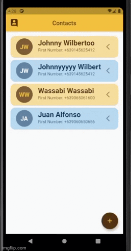
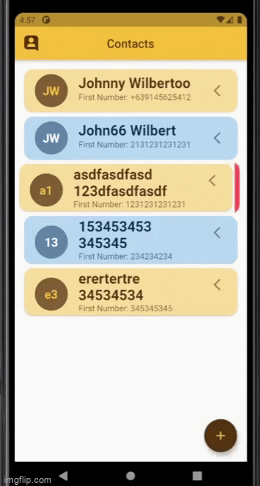

# phonebook_app

A new Flutter phonebook application.

## Screens

Blah blah blah!

>#### Open App -> Main Screen
>

Blah blah blah!Blah blah blah!Blah blah blah!

>#### Main Screen Features: Dialog, Dismissible, Refresh indicator, Delete
>
>
>
>

Blah blah blah!

>#### Main Screen -> Create Screen
>

Blah blah blah!

>#### Main Screen -> Create Screen
>

Blah blah blah!

>#### Main Screen -> Edit Screen
>

Blah blah blah!

>#### Edit Screen Features: Initialize Number, Refresh Form, Edit(Name, Number), Add Numbers
>
>
>
>
>
>

>#### Edit Screen OnBack 

>
>